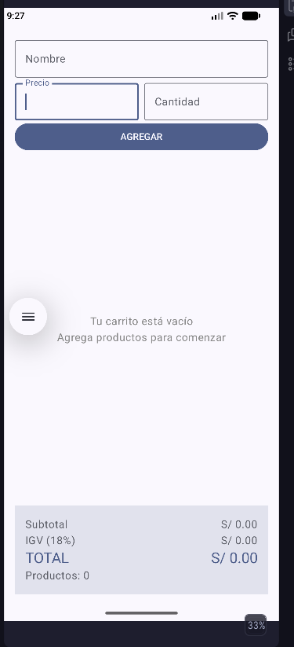
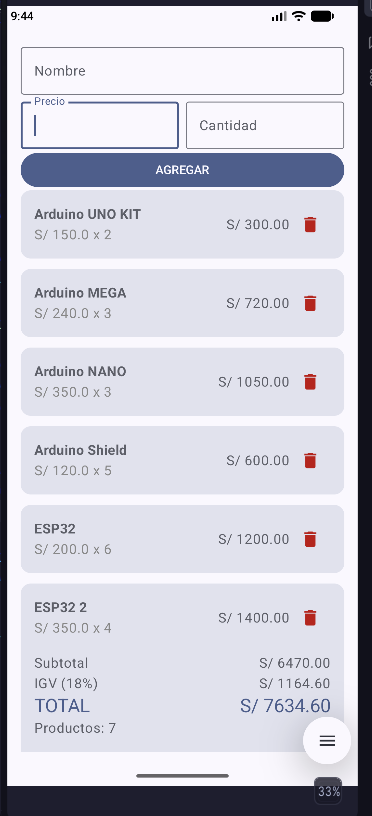

##Titulo:Mi Carrito TECSUP con LazyColumn
##Estudiante: Yamil Aaron Ochoa Quispe
Descripcion: En este proyecto se desarrolló un carrito de compras con listas usando Column y LazyColumn, aplicando los conceptos de estados mutables y no mutables, también remember para estados y para listas, que permiten mantener los datos al recargar la pantalla

ESTADO VACIO: 

ESTADO CON PRODUCTOS: 

Preguntas:
-¿por qué la lista se declara con val y aún así podemos agregarle elementos?

-porque val en kotlin solo impide reasignar valores de la variable, y no afecta al contenido de la lista

a.¿Porque mutableStateListOf y no una Mutablelist normal?

-Porque mutableStateListOf, permite redibujar la pantalla, mientras se añaden o quitan elementos
b.¿Porque la lista es val?

-Porque no se va a reasginar su valor

c.¿Que hace weight(1f) en la LazyColumn?

-Permite al LazyColumn que utilice el espacio disponible y restante en pantalla.
