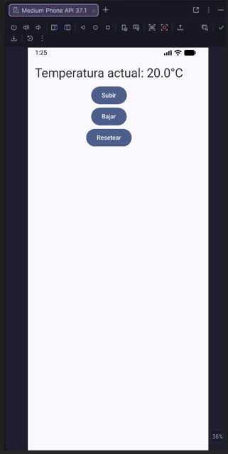
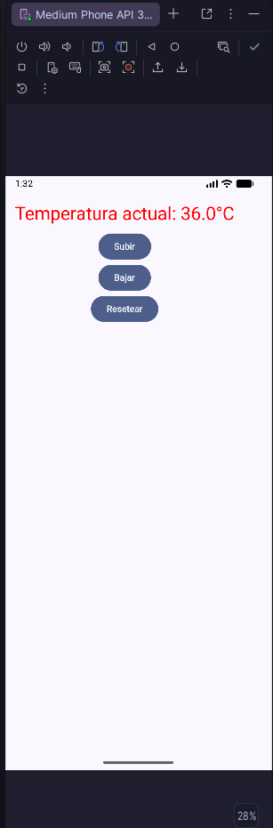
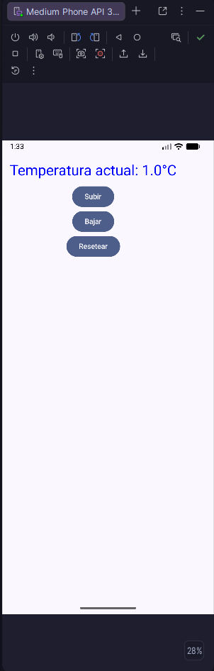
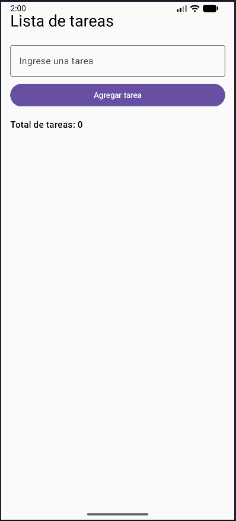

## LABORATORIO 04
Titulo: Desarrollo de una aplicacion básica de control de tareas usando manejo de estados en Jetpack Compose
Estudiante: Yamil Aaron Ochoa Quispe
Curso: Programacion en Aplicaciones Moviles

En este laboratorio se desarrollo el manejo de estados en Kotlin usando las siguientes Herramientas:
## remember 
## mutableStateOf
## State hoisting
## ViewModel + StateFLow
## collectAsStateWithLifecycle

Tarea 01: 

Reset:

Superior a 30°:

Inferior a 10°:

Proyecto lab04:

con pruebas: 

